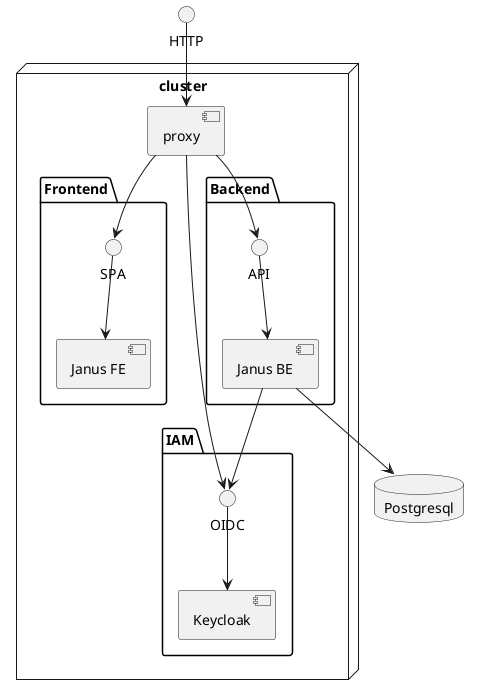

```plantuml
@startuml

node "cluster" {
[proxy]

package "Frontend" {
  SPA-->[Janus FE]
}

package "Backend" {
  API-->[Janus BE]
}

package "IAM" {
  OIDC-->[Keycloak]
}

}

database "Postgresql" {

}

[Janus BE] --> Postgresql
[Janus BE] --> OIDC
[proxy] --> API
[proxy] --> SPA
[proxy] --> OIDC
HTTP --> proxy

@enduml
```