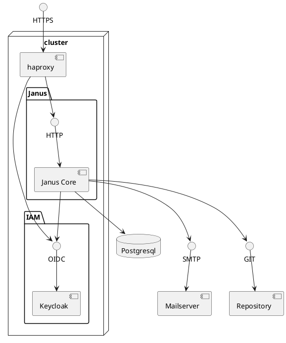

```plantuml
@startuml

node "cluster" {
[haproxy]

package "Janus" {
  HTTP-->[Janus Core]
}

package "IAM" {
  OIDC-->[Keycloak]
}

}

database "Postgresql" {

}

SMTP-->[Mailserver]
GIT-->[Repository]

[Janus Core] --> Postgresql
[Janus Core] --> OIDC
[Janus Core] --> SMTP
[Janus Core] --> GIT
[haproxy] --> HTTP
[haproxy] --> OIDC
HTTPS --> haproxy

@enduml
```