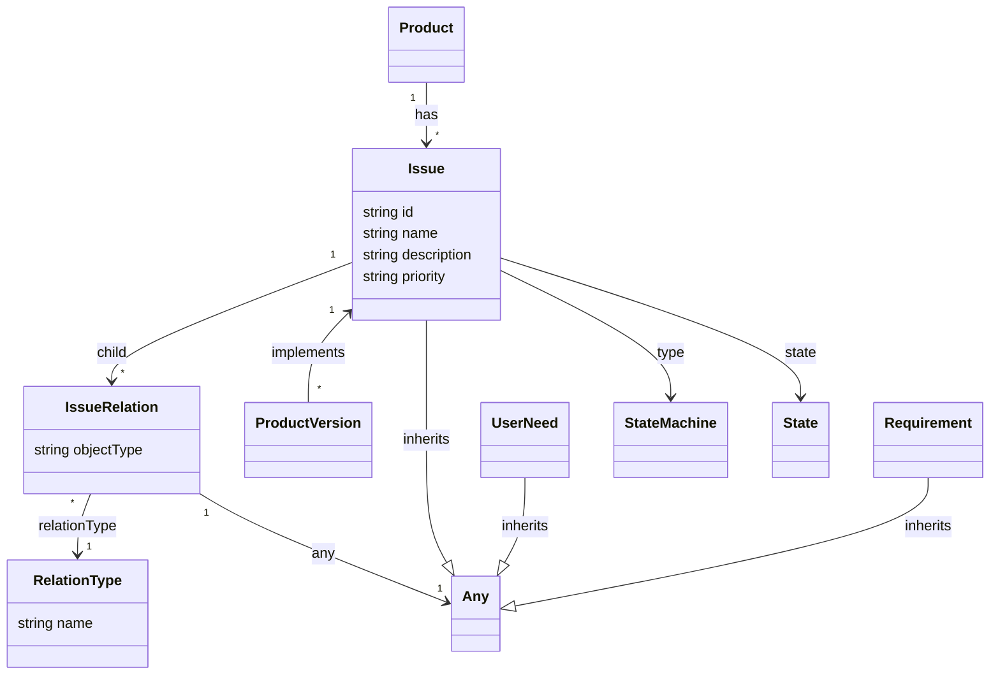

```mermaid
classDiagram
    class Issue {
        string id
        string name
        string description
        string priority
    }
    class IssueRelation {
        string objectType
    }
    class RelationType {
        string name
    }
    Issue "1" <-- "*" ProductVersion : implements
    IssueRelation "*" --> "1" RelationType : relationType
    Product "1" --> "*" Issue : has
    Issue "1" --> "*" IssueRelation : child
    IssueRelation "1" --> "1" Any : any
    Issue --|> Any : inherits
    UserNeed --|> Any : inherits
    Requirement --|> Any : inherits
    Issue --> StateMachine : type
    Issue --> State : state
```