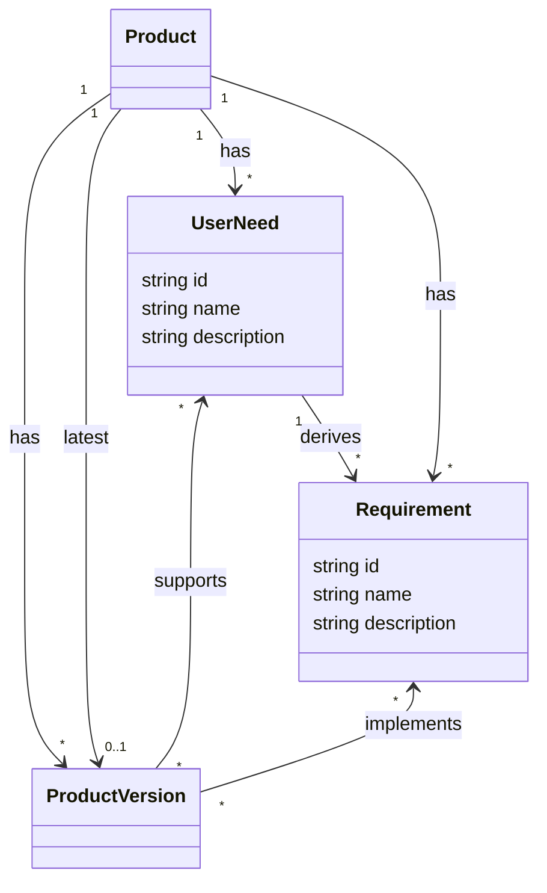

```mermaid
classDiagram
    class UserNeed {
        string id
        string name
        string description
    }
    class Requirement {
        string id
        string name
        string description
    }
    class Product {
    }
    class ProductVersion {
    }

    Product "1" --> "*" UserNeed : has
    Product "1" --> "*" ProductVersion : has
    Product "1" --> "0..1" ProductVersion : latest
    UserNeed "1" --> "*" Requirement : derives
    UserNeed "*" <-- "*" ProductVersion : supports
    Requirement "*" <-- "*" ProductVersion : implements
    Product "1" --> "*" Requirement : has
```