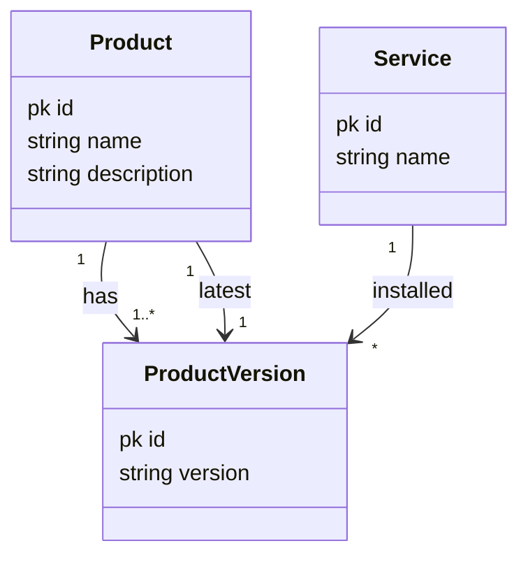

```mermaid
classDiagram
    class Service {
        pk id
        string name
    }
    class Product {
        pk id
        string name
        string description
    }
    class ProductVersion {
        pk id
        string version
    }
    Product "1" --> "1..*" ProductVersion : has
    Product "1" --> "1" ProductVersion : latest
    Service "1" --> "*" ProductVersion : installed
```
