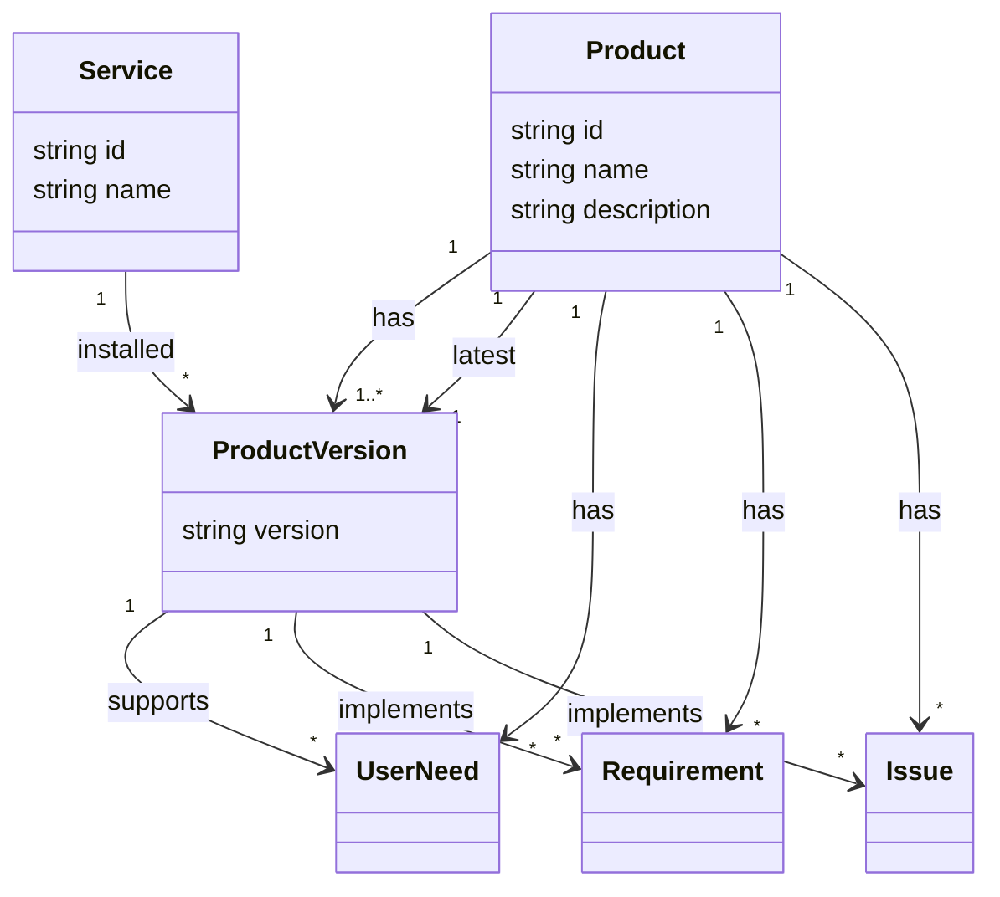

```mermaid
classDiagram
    class Service {
        string id
        string name
    }
    class Product {
        string id
        string name
        string description
    }
    class ProductVersion {
        string version
    }
    Service "1" --> "*" ProductVersion : installed
    Product "1" --> "1..*" ProductVersion : has
    Product "1" --> "1" ProductVersion : latest
    Product "1" --> "*" UserNeed : has
    ProductVersion "1" --> "*" UserNeed : supports
    Product "1" --> "*" Requirement : has
    ProductVersion "1" --> "*" Requirement : implements
    Product "1" --> "*" Issue : has
    ProductVersion "1" --> "*" Issue : implements
```
