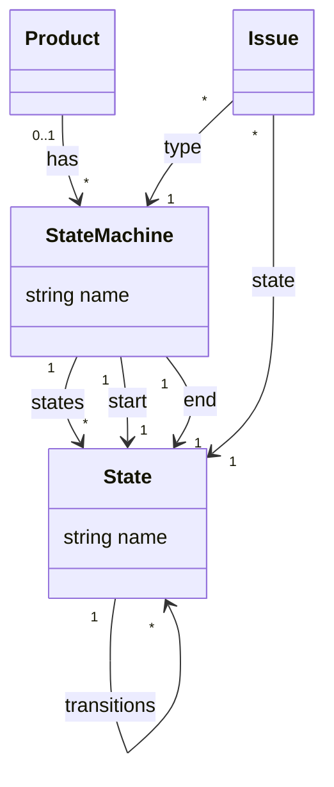

```mermaid
classDiagram
    class StateMachine {
        string name
    }
    class State {
        string name
    }
    Product "0..1" --> "*" StateMachine : has
    StateMachine "1" --> "*" State : states
    StateMachine "1" --> "1" State : start
    StateMachine "1" --> "1" State : end
    State "1" --> "*" State : transitions
    Issue "*" --> "1" StateMachine : type
    Issue "*" --> "1" State : state
```