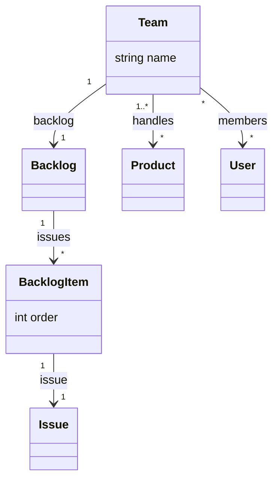

```mermaid
classDiagram
    class Team {
        string name
    }
    class Backlog {      
    }
    class BacklogItem {
        int order
    }
    Team "1..*" --> "*" Product : handles
    Team "*" --> "*" User : members
    Team "1" --> "1" Backlog : backlog
    Backlog "1" --> "*" BacklogItem : issues
    BacklogItem "1" --> "1" Issue : issue
```