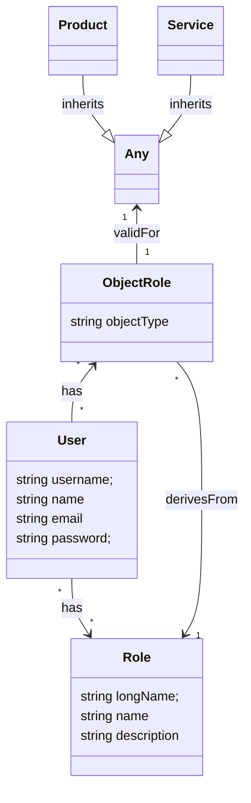

```mermaid
classDiagram
    class User {
        string username;
        string name
        string email
        string password;
    }
    class ObjectRole {
        string objectType
    }   
    class Role {
        string longName;
        string name
        string description
    }
    User "*" --> "*" Role : has
    ObjectRole "*" --> "1" Role : derivesFrom
    ObjectRole "*" <-- "*" User : has
    Any "1" <-- "1" ObjectRole : validFor
    Product --|> Any : inherits
    Service --|> Any : inherits
```