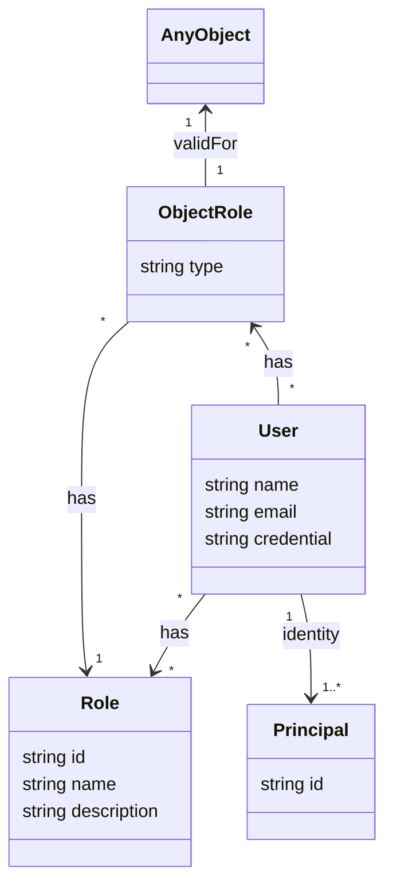

```mermaid
classDiagram
    class User {
        string name
        string email
        string credential
    }
    class Principal {
        string id
    }
    class ObjectRole {
        string type
    }   
    class Role {
        string id
        string name
        string description
    }
    class AnyObject {
    }
    User "*" --> "*" Role : has
    User "1" --> "1..*" Principal : identity
    ObjectRole "*" --> "1" Role : has
    ObjectRole "*" <-- "*" User : has
    AnyObject "1" <-- "1" ObjectRole : validFor
```