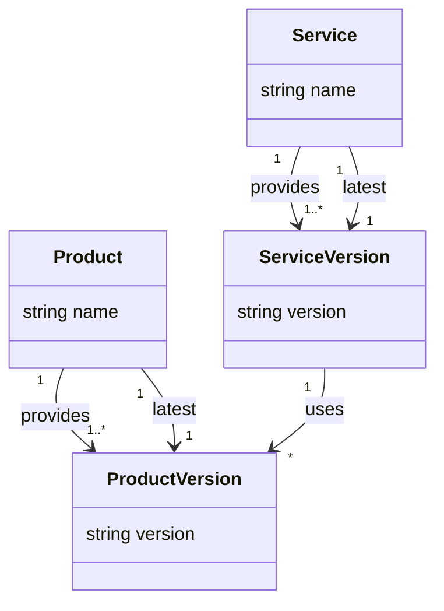
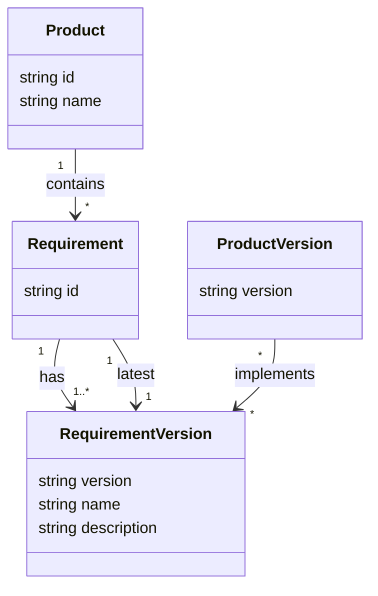
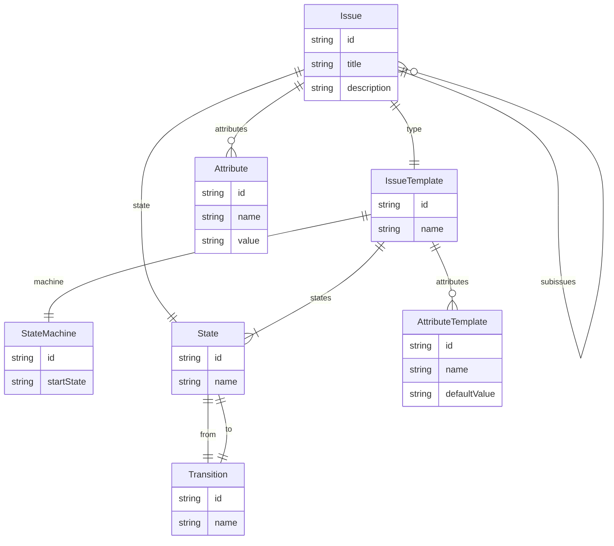

# Information model
The information model for the product.

## Services and products

```mermaid
classDiagram
    class Service {
        string name
    }
    class ServiceVersion {
        string version
    }
    Service "1" --> "1..*" ServiceVersion : provides
    Service "1" --> "1" ServiceVersion : latest
    class Product {
        string name
    }
    class ProductVersion {
        string version
    }
    Product "1" --> "1..*" ProductVersion : provides
    Product "1" --> "1" ProductVersion : latest
    ServiceVersion "1" --> "*" ProductVersion : uses
```

## Requirements

```mermaid
classDiagram
    class Product {
        string id
        string name
    }
    class ProductVersion {
        string version
    }
    class Requirement {
        string id
    }
    class RequirementVersion {
        string version
        string name
        string description
    }
    Requirement "1" --> "1..*" RequirementVersion : has
    Requirement "1" --> "1" RequirementVersion : latest
    ProductVersion "*" --> "*" RequirementVersion : implements
    Product "1" --> "*" Requirement : contains
```

## Issues 

```mermaid
erDiagram
    Issue {
        string id
        string title
        string description
    }
    IssueTemplate {
        string id
        string name
    }
    StateMachine {
        string id
        string startState
    }
    State {
        string id
        string name
    }
    Transition {
        string id
        string name
    }
    Attribute {
        string id
        string name
        string value
    }
    AttributeTemplate {
        string id
        string name
        string defaultValue
    }    
    Issue ||--o{ Issue: "subissues"
    Issue ||--o{ Attribute : "attributes"
    Issue ||--|| State : "state"
    Issue ||--|| IssueTemplate : "type"
    IssueTemplate ||--|| StateMachine : "machine"
    IssueTemplate ||--|{ State : "states"
    IssueTemplate ||--o{ AttributeTemplate : "attributes"
    State ||--|| Transition : "from"
    Transition ||--|| State : "to"
```
