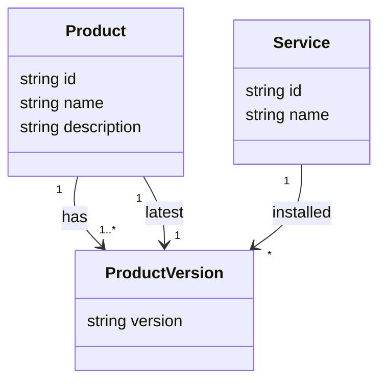

# Information model
The logical information model for the application.

## Services and products

### Product and ProductVersion

#### Product
A product is a software application that is released in different versions. They can be installed and run and is then considered a service or a part of a service.

|Name|Type|Value Set|Description|
|---|---|---|---|
|id|string|alfanumeric|The identity of the product, typical a shortening of the name|
|name|string|alfanumeric|The name of the product|
|description|string|alfanumeric|A description of the product|
|has|list of ProductVersion|fk|A list of all versions of the product|
|latest|ProductVersion|fk|The latest release of the product|

#### ProductVersion
A product is released as a specific version. Most of the work related to a product is connected to its specific target version.

|Name|Type|Value Set|Description|
|---|---|---|---|
|version|string|alfanumeric|The version of the product, or release of a product|

### Service

## Requirements

## Issues 

